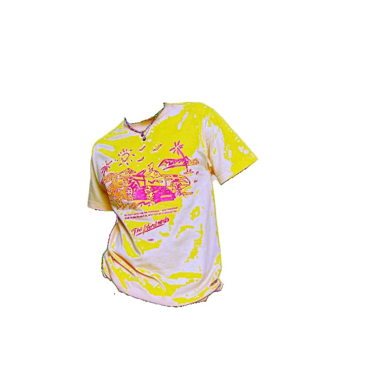
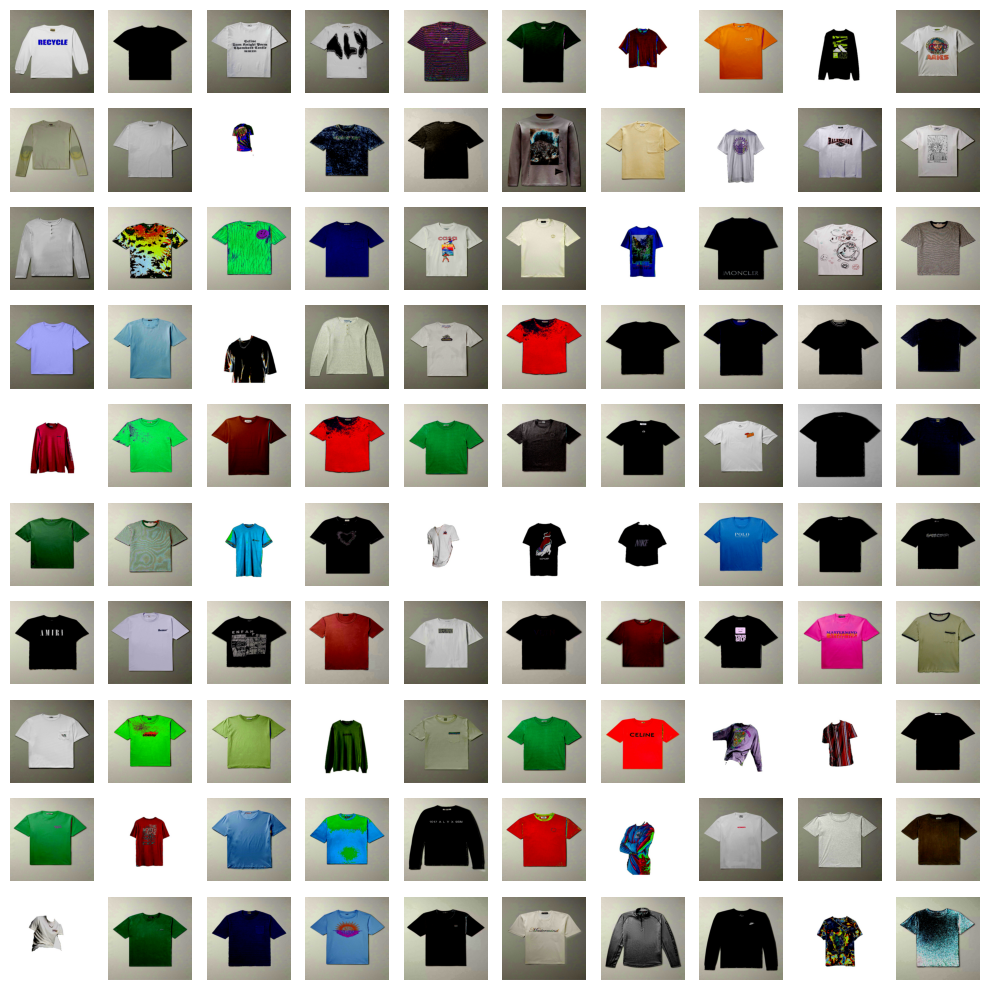
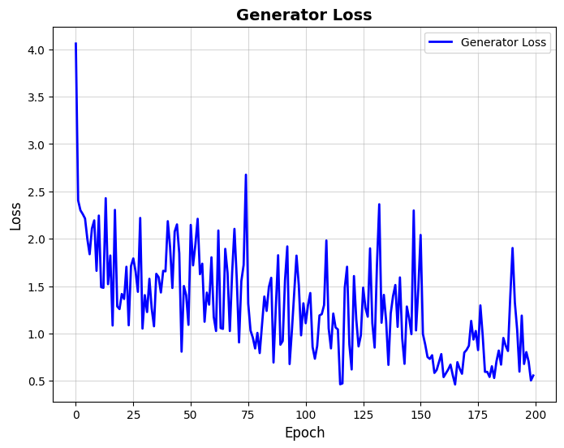
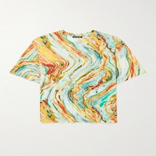
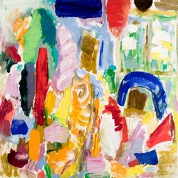
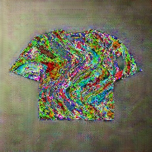

# Picartsso – End-to-End Image Style Transfer and Segmentation (Experimental)

**Picartsso is a complete experimental pipeline for dataset analysis, image preprocessing, model training, and deploying a web application for neural style transfer on clothing items. Made on the basis of what if? (if we concatenate Input (shirt) and Reference (art) Image channels, then overfit generator on concatenated channels, while Discriminator judges on reconstruction of original Input (shirt), meanwhile the art channels leave their Residue)**

The repository consists of:

- **Data Preparation (DS-DataPrep.ipynb):** Image preprocessing and segmentation using a deep learning model.
- **Dataset Analysis (EDA.ipynb):** Exploratory Data Analysis (EDA) on the dataset to understand class distribution, image properties, and segmentation accuracy.
- **Model Training (Model-Training.ipynb):** Training a style transfer GAN.
- **Web Application (picartsso.py):** A Streamlit-based app for real-time style transfer.


---

## Repository Structure

```
/
|-- EDA.ipynb                # Exploratory Data Analysis on dataset
|-- DS-DataPrep.ipynb        # Notebook for segmentation and preprocessing
|-- Model-Training.ipynb     # Notebook for training the style transfer GAN
|-- picartsso.py             # Streamlit app for real-time style transfer
|-- merger.py                # External module for style transfer logic
|-- images/
      |-- input.jpg          # Sample shirt image
      |-- reference_art.jpg  # Sample reference art
      |-- output.jpg         # Generated output after style transfer
|-- README.md                # Documentation file
```

---


## 1. Data Preparation (Segmentation)

**Notebook: DS-DataPrep.ipynb**

This notebook processes images by segmenting the shirt region using a deep learning model.

### **1.1 Preprocessing Pipeline**
- **Resizing:** Standardizes images to 768×768.
- **Normalization:** Converts images into tensors for model input.
- **Segmentation Mask Extraction:**  
  - Applies U^2-Net to extract the shirt region.
  - Converts masks to RGBA format for alpha transparency.

- **Visualization of Segmented Shirts:**
  - Sample output:

        

---

## 2. Dataset Analysis (EDA)

**Notebook: EDA.ipynb**

This notebook provides insights into the dataset before training. It includes:

### **2.1 Dataset Statistics**
- **Image Distribution:**  
  - Plots showing the number of images per category.
  - Visualizations of image resolutions and aspect ratios.
  
- **Class Imbalance Check:**  
  - A bar chart displays the number of samples per clothing type.
  - Helps determine if rebalancing is needed before training.

### **2.2 Image Quality Inspection**
- **Random Sample Previews:**  
  - Uses `matplotlib` to display a grid of random dataset images.
  - Checks for corrupt or low-quality images.

- **Segmentation Accuracy Check:**  
  - Overlays segmentation masks on sample images.
  - Uses `cv2.addWeighted()` to blend original images with their corresponding masks.
  - Example output:

  

### **2.3 Color Distribution**
- **Histograms:**  
  - RGB and HSV color distribution analysis.
  - Helps assess whether some colors dominate in the dataset.

- **Pixel Intensity Analysis:**  
  - Mean pixel values across different images to determine contrast variations.

---

## 3. Model Training

**Notebook: Model-Training.ipynb**

### **3.1 Generator Architecture**
- Accepts a **6-channel tensor** (shirt + reference art).
- Uses **9 residual blocks** for feature preservation.
- Outputs an RGB-stylized image.

### **3.2 Discriminator**
- Patch-based CNN to distinguish real vs. fake styled images.
- Uses **LeakyReLU activations** and **instance normalization**.

### **3.3 Training Process**
- **Loss Functions:**  
  - **Adversarial Loss:** Ensures realistic stylized outputs.  
  - **Reconstruction Loss:** Preserves shirt details.  

- **Performance Metrics:**  
  - Loss plots visualized over epochs:

        

---

## 4. Web Application – Picartsso

**Script: picartsso.py**

A **Streamlit** app allowing users to:
- Upload a **shirt image** (`input.jpg`).
- Upload a **reference artwork** (`reference_art.jpg`).
- Apply the trained style transfer model to generate `output.jpg`.

### **4.1 Example Usage**
**Input Shirt:**  
    

**Reference Art:**  
    

**Generated Output:**  
    

---

## 5. How to Run


### **Run Web App**
Make sure to fit the trained model first!
```
streamlit run picartsso.py
```

---

## 6. Future Improvements
- **Enhance dataset diversity** to reduce bias.
- **Fine-tune hyperparameters** for better style preservation.
- **Deploy the model online** via Hugging Face or Streamlit Cloud.

---

## 7. Credits
Developed as experimental part of project **** using **GANs**.
